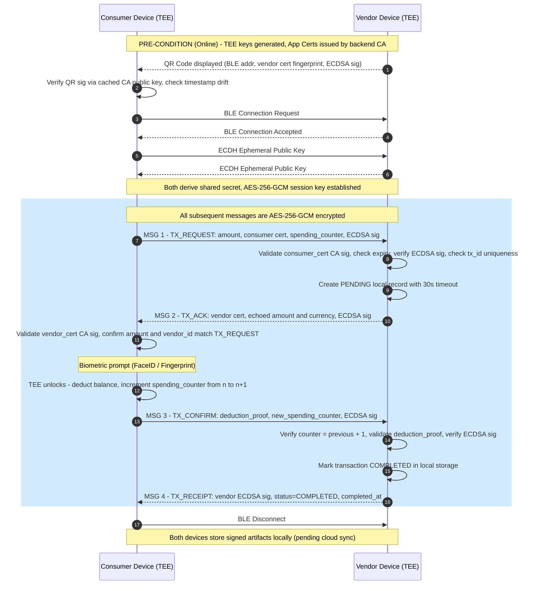
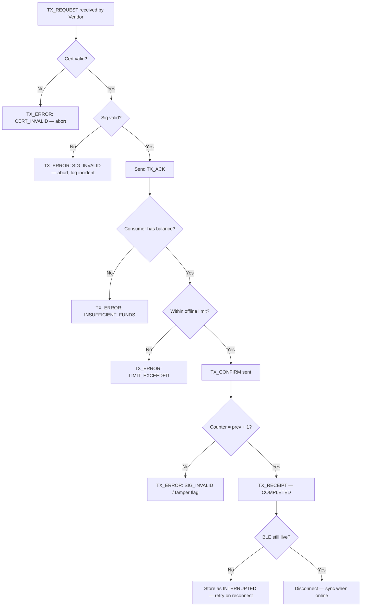
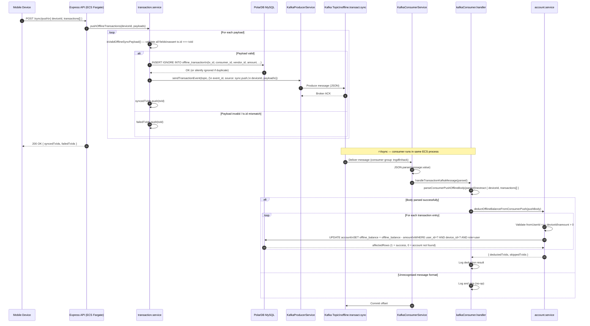
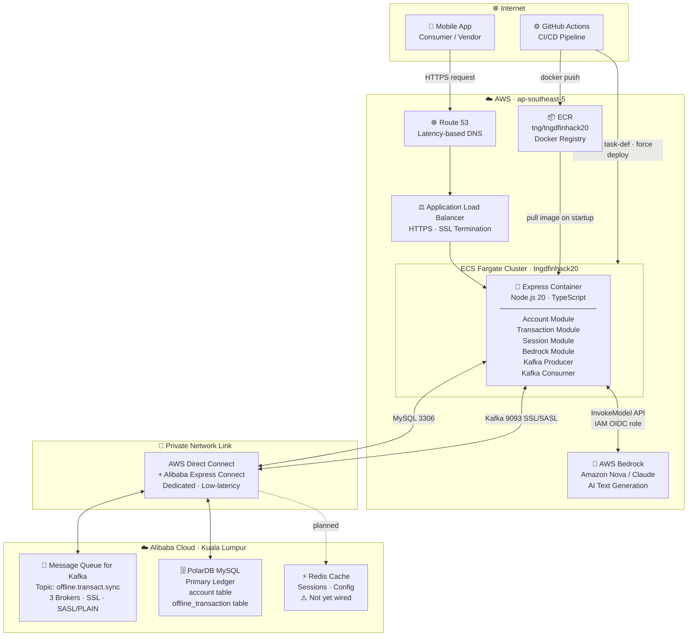
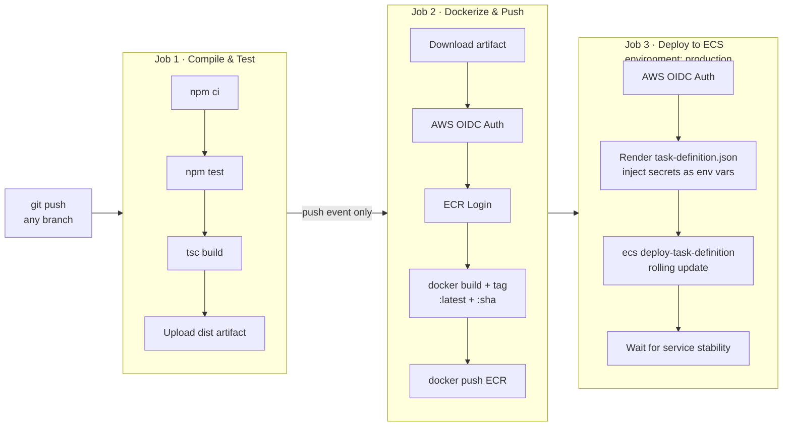

# Global E-Wallet Backend — Official Project Documentation

> **Project:** Global E-Wallet (Offline Transaction MVP)  
> **Version:** 1.0.0  
> **Generated:** April 2026

---

## Table of Contents

1. [Project Overview](#1-project-overview)
2. [Technology Stack](#2-technology-stack)
3. [Architecture & Design](#3-architecture--design)
4. [API Details](#4-api-details)
5. [Authentication & Authorization](#5-authentication--authorization)
6. [Data Models](#6-data-models)
7. [Error Handling](#7-error-handling)
8. [Configuration & Environment](#8-configuration--environment)
9. [Setup & Running the Project](#9-setup--running-the-project)
10. [Testing](#10-testing)
11. [Deployment](#11-deployment)
12. [Assumptions, Limitations & Future Improvements](#12-assumptions-limitations--future-improvements)
13. [System Diagrams](#13-system-diagrams)

---

## 1. Project Overview

### 1.1 Project Name

**Global E-Wallet (Offline Transaction MVP)**

### 1.2 Purpose & Business Problem

This project is the cloud backend for a highly scalable e-wallet system that enables **secure, strictly offline peer-to-peer payments** between consumers and merchants. The core value proposition is connectivity independence: in regions or situations with zero internet access, a consumer can pay a vendor using Bluetooth Low Energy (BLE), with full cryptographic security guarantees.

Key problems solved:

- **Offline payment integrity** — Transactions are cryptographically signed by TEE (Trusted Execution Environment) hardware keys, making tampering mathematically detectable.
- **Double-spend prevention** — A monotonic spending counter stored in the TEE prevents replay of old balance states.
- **Ghost Device fraud** — Short-lived, user-configurable offline certificates ensure revoked devices cannot spend indefinitely.
- **Synchronization at scale** — An event-driven Kafka pipeline absorbs massive reconnection spikes when many devices come back online simultaneously.

### 1.3 Target Users / Systems

- **Consumers (payers):** End-users with a mobile wallet app.
- **Merchants/Vendors (payees):** Businesses accepting BLE payments.
- **Mobile Client:** The Flutter/native mobile app that calls these APIs after regaining connectivity.
- **External Integrators:** Downstream reconciliation or analytics systems consuming Kafka events.

### 1.4 High-Level Architecture

A **Component-Split Multi-Cloud** design:

- **AWS (ap-southeast-5):** Stateless compute and API ingress — ECS Fargate containers fronted by an Application Load Balancer (ALB) and Route 53.
- **Alibaba Cloud (Kuala Lumpur):** High-performance data and messaging backbone — PolarDB MySQL (primary ledger), Redis (caching), Kafka (async event bus).
- **Cross-Cloud Connectivity:** AWS Direct Connect + Alibaba Cloud Express Connect private link to minimize latency between the compute and data layers.

---

## 2. Technology Stack

| Category | Technology |
|---|---|
| **Runtime** | Node.js 20 |
| **Language** | TypeScript 5 |
| **Web Framework** | Express.js 4 |
| **Database Driver** | `mysql2` (promise-based pool) |
| **Database** | Alibaba Cloud PolarDB (MySQL-compatible) |
| **Message Broker** | Apache Kafka via `kafkajs` (Alibaba Cloud MQ) |
| **Cache** | Alibaba Cloud Redis *(referenced in specs; not yet wired in backend code)* |
| **AI / LLM** | AWS Bedrock — `@aws-sdk/client-bedrock-runtime` (Claude / Amazon Nova) |
| **Containerisation** | Docker (multi-stage, Node 20 Alpine) |
| **CI/CD** | GitHub Actions |
| **Compute (Cloud)** | AWS ECS Fargate |
| **Registry** | AWS Elastic Container Registry (ECR) |
| **Authentication** | None at API layer in current MVP *(see §5)* |

---

## 3. Architecture & Design

### 3.1 Overall Architectural Style

- **Layered / Modular Monolith** — The backend is a single Express application partitioned into feature modules (`account`, `transaction`, `session`, `bedrock`, `ledger`) with a shared `infrastructure` layer.
- **Event-Driven Processing** — Write-heavy sync operations are decoupled via Kafka. The API ingests and immediately produces to Kafka, returning `202 Accepted`; Kafka worker consumers process asynchronously.
- **Optimistic Execution** — The first device (consumer or vendor) to sync triggers ledger updates immediately. Subsequent duplicate syncs are idempotent (`INSERT IGNORE`).

### 3.2 Key Components & Responsibilities

| Component | Location | Responsibility |
|---|---|---|
| `main.ts` | `src/main.ts` | App bootstrap, Express middleware, graceful shutdown |
| Account Module | `src/modules/account/` | Account lookup/creation, offline balance deduction |
| Transaction Module | `src/modules/transaction/` | Offline transaction validation, DB write, Kafka publish |
| Session Module | `src/modules/session/` | Thin session-init wrapper over account service |
| Bedrock Module | `src/modules/bedrock/` | AI text generation via AWS Bedrock with fallback |
| Ledger Models | `src/modules/ledger/models.ts` | TypeScript interface definitions for core entities |
| DB Service | `src/infrastructure/db.service.ts` | MySQL connection pool (PolarDB) |
| Kafka Service | `src/infrastructure/kafka.service.ts` | Kafka producer + consumer lifecycle |
| Kafka Handler | `src/infrastructure/kafkaConsumer.handler.ts` | Business logic for consumed Kafka messages |
| Bedrock Service | `src/infrastructure/bedrock.service.ts` | AWS Bedrock client and invocation helper |

### 3.3 Folder / Package Structure

```
src/
├── main.ts                          # Express app entry point & server bootstrap
├── infrastructure/
│   ├── db.service.ts                # MySQL connection pool
│   ├── kafka.service.ts             # KafkaProducerService & KafkaConsumerService
│   ├── kafkaConsumer.handler.ts     # Kafka message handler (balance deduction)
│   └── bedrock.service.ts           # AWS Bedrock invocation helper
└── modules/
    ├── account/
    │   ├── account.controller.ts    # POST /account, GET /account
    │   └── account.service.ts       # DB queries, balance deduction logic
    ├── transaction/
    │   ├── transaction.controller.ts # POST /api/transactions/*, POST /sync/push
    │   └── transaction.service.ts    # Payload validation, DB insert, Kafka publish
    ├── session/
    │   └── session.controller.ts    # POST /session/init
    ├── bedrock/
    │   └── bedrock.controller.ts    # POST /api/bedrock/invoke
    └── ledger/
        └── models.ts                # Core TypeScript entity interfaces
```

### 3.4 Request → Response Lifecycle

**Online Sync Flow (happy path):**

```
Mobile Client
    │
    ▼  HTTPS
AWS Route 53 → ALB → ECS Fargate (Express)
    │
    ├─── Validates request body
    │
    ├─── Writes record to PolarDB (via Direct Connect)          [sync/push]
    │
    ├─── Publishes Kafka event (offline.transact.sync topic)    [async]
    │
    └─── Returns 202 Accepted to client

Kafka Consumer (same ECS process)
    │
    ├─── Parses message
    ├─── Deducts offline_balance from account (PolarDB)
    └─── Logs result
```

**Offline BLE Transaction Flow (mobile, no backend involved):**

```
Consumer Device ──QR Scan──► Vendor Device
    │  ECDH key exchange → AES-256-GCM session
    │
    ├─ TX_REQUEST  ──────────────────────────►
    │◄─ TX_ACK     ──────────────────────────
    │  [TEE biometric auth → balance deducted locally]
    ├─ TX_CONFIRM  ──────────────────────────►
    │◄─ TX_RECEIPT ──────────────────────────
    │  [BLE disconnects]
    │
    └─ When online: push signed artifacts → backend sync
```

---

## 4. API Details

**Base URL:** `http://localhost:3000` (local) / `https://<alb-dns>` (production)

---

### 4.1 `GET /health`

| Field | Value |
|---|---|
| **Method** | `GET` |
| **Path** | `/health` |
| **Description** | Liveness check. Returns server status and current timestamp. |
| **Auth Required** | No |

**Request:** No body or query parameters required.

**Success Response `200 OK`:**
```json
{
  "status": "ok",
  "timestamp": "2026-04-25T08:00:00.000Z"
}
```

---

### 4.2 `GET /api/db-test`

| Field | Value |
|---|---|
| **Method** | `GET` |
| **Path** | `/api/db-test` |
| **Description** | Verifies live database connectivity by executing `SELECT NOW()`. |
| **Auth Required** | No |

**Success Response `200 OK`:**
```json
{
  "success": true,
  "now": "2026-04-25T08:00:00.000Z"
}
```

**Error Response `500 Internal Server Error`:**
```json
{
  "success": false,
  "error": "Connection refused"
}
```

---

### 4.3 `POST /account`

| Field | Value |
|---|---|
| **Method** | `POST` |
| **Path** | `/account` |
| **Description** | Finds an existing account or creates a new one for the given device ID and role. New user accounts are seeded with `1000 USD` offline balance; merchant accounts start at `0`. |
| **Auth Required** | No |
| **Content-Type** | `application/json` |

**Request Body:**
```json
{
  "deviceId": "user-abc123",
  "role": "user"
}
```

| Field | Type | Required | Description |
|---|---|---|---|
| `deviceId` | `string` | Yes | Unique device identifier |
| `role` | `string` | Yes | `"user"` (consumer) or `"merchant"` (vendor) |

**Success Response `200 OK`:**
```json
{
  "success": true,
  "userId": "user-abc123",
  "displayName": "User abc123",
  "offlineBalance": 1000,
  "status": "active",
  "merchantName": "Store abc123"
}
```

> `merchantName` is only present when `role` is `"merchant"`.

**Error Response `400 Bad Request`:**
```json
{
  "success": false,
  "error": {
    "code": "INVALID_PAYLOAD",
    "message": "Both deviceId and role are required in the JSON body."
  }
}
```

**Error Response `500 Internal Server Error`:**
```json
{
  "success": false,
  "error": {
    "code": "INTERNAL_ERROR",
    "message": "Failed to create or fetch account."
  }
}
```

---

### 4.4 `GET /account`

| Field | Value |
|---|---|
| **Method** | `GET` |
| **Path** | `/account` |
| **Description** | Retrieves an account with its full offline transaction history (consumer transactions ordered by timestamp descending). |
| **Auth Required** | No |

**Query Parameters:**

| Parameter | Type | Required | Description |
|---|---|---|---|
| `deviceId` | `string` | Yes | Device identifier |
| `role` | `string` | Yes | `"user"` or `"merchant"` |

**Example Request:**
```
GET /account?deviceId=user-abc123&role=user
```

**Success Response `200 OK`:**
```json
{
  "success": true,
  "deviceId": "user-abc123",
  "userId": "user-abc123",
  "role": "user",
  "offlineBalance": 974.5,
  "currency": "USD",
  "transactions": [
    {
      "id": "b7c9d1e3-4f5a-6b7c-8d9e-0f1a2b3c4d5e",
      "amount": 25.5,
      "currency": "USD",
      "timestamp": 1745571660,
      "fromUserId": "user-abc123",
      "toMerchantId": "merchant-xyz",
      "status": "completed",
      "syncStatus": "pending_sync"
    }
  ]
}
```

**Error Response `400 Bad Request`:**
```json
{
  "success": false,
  "error": {
    "code": "INVALID_QUERY",
    "message": "Both deviceId and role query parameters are required."
  }
}
```

**Error Response `404 Not Found`:**
```json
{
  "success": false,
  "error": {
    "code": "ACCOUNT_NOT_FOUND",
    "message": "No account was found for the provided deviceId and role."
  }
}
```

---

### 4.5 `POST /session/init`

| Field | Value |
|---|---|
| **Method** | `POST` |
| **Path** | `/session/init` |
| **Description** | Initialises or resumes a user session. Functionally equivalent to `POST /account` — finds or creates an account and returns identity data. Intended as the app launch handshake. |
| **Auth Required** | No |
| **Content-Type** | `application/json` |

**Request Body:**
```json
{
  "deviceId": "user-abc123",
  "role": "user"
}
```

**Success Response `200 OK`:**
```json
{
  "success": true,
  "userId": "user-abc123",
  "displayName": "User abc123",
  "offlineBalance": 1000,
  "status": "active"
}
```

> `merchantName` is included when `role` is `"merchant"`.

**Error Responses:** Same structure as `POST /account`.

---

### 4.6 `POST /api/transactions/sync`

| Field | Value |
|---|---|
| **Method** | `POST` |
| **Path** | `/api/transactions/sync` |
| **Description** | Accepts an array of signed offline transaction artifacts and publishes each as a Kafka event for asynchronous processing. Does **not** write directly to the database. Returns `202 Accepted` immediately (optimistic). |
| **Auth Required** | No |
| **Content-Type** | `application/json` |

**Request Body:**
```json
{
  "transactions": [
    {
      "txId": "b7c9d1e3-4f5a-6b7c-8d9e-0f1a2b3c4d5e",
      "side": "consumer",
      "queuedAt": 1745571660000,
      "tx": {
        "id": "b7c9d1e3-4f5a-6b7c-8d9e-0f1a2b3c4d5e",
        "amount": 25.50,
        "currency": "USD",
        "timestamp": 1745571660,
        "fromUserId": "user-abc123",
        "toMerchantId": "merchant-xyz",
        "status": "completed",
        "signature": "<ECDSA signature>",
        "userPubKey": "<consumer public key>",
        "cert": "<consumer certificate>",
        "ackSignature": "<vendor ack signature>",
        "merchantPubKey": "<merchant public key>",
        "syncStatus": "pending_sync"
      }
    }
  ]
}
```

**Success Response `202 Accepted`:**
```json
{
  "success": true,
  "message": "Transactions accepted for processing"
}
```

**Error Response `400 Bad Request`:**
```json
{
  "success": false,
  "error": {
    "code": "INVALID_PAYLOAD",
    "message": "Expected an array of transactions"
  }
}
```

---

### 4.7 `POST /sync/push`

| Field | Value |
|---|---|
| **Method** | `POST` |
| **Path** | `/sync/push` |
| **Description** | The primary device sync endpoint. Validates each transaction payload, writes valid records to `offline_transaction` (idempotent via `INSERT IGNORE`), deducts the consumer's offline balance (via Kafka handler), and publishes a Kafka event. Returns per-transaction sync result. |
| **Auth Required** | No |
| **Content-Type** | `application/json` |

**Request Body:**
```json
{
  "deviceId": "user-abc123",
  "transactions": [
    {
      "txId": "b7c9d1e3-4f5a-6b7c-8d9e-0f1a2b3c4d5e",
      "side": "consumer",
      "queuedAt": 1745571660000,
      "tx": {
        "id": "b7c9d1e3-4f5a-6b7c-8d9e-0f1a2b3c4d5e",
        "amount": 25.50,
        "currency": "USD",
        "timestamp": 1745571660,
        "fromUserId": "user-abc123",
        "toMerchantId": "merchant-xyz",
        "status": "completed",
        "signature": "<ECDSA signature>",
        "userPubKey": "<consumer public key>",
        "cert": "<consumer certificate>",
        "ackSignature": "<vendor ack signature>",
        "merchantPubKey": "<merchant public key>",
        "syncStatus": "pending_sync"
      }
    }
  ]
}
```

**Validation rules enforced in `transaction.service.ts`:**
- All fields in `tx` object must be present and typed correctly.
- `tx.id` must equal `txId` (prevents payload substitution attacks).

**Success Response `200 OK`:**
```json
{
  "syncedTxIds": ["b7c9d1e3-4f5a-6b7c-8d9e-0f1a2b3c4d5e"],
  "failedTxIds": []
}
```

**Error Response `400 Bad Request`:**
```json
{
  "success": false,
  "error": {
    "code": "INVALID_PAYLOAD",
    "message": "deviceId is required"
  }
}
```

---

### 4.8 `POST /api/transactions/event`

| Field | Value |
|---|---|
| **Method** | `POST` |
| **Path** | `/api/transactions/event` |
| **Description** | Low-level endpoint that directly publishes an arbitrary message to a Kafka topic. Intended for integration testing and internal tooling. |
| **Auth Required** | No |
| **Content-Type** | `application/json` |

**Request Body:**
```json
{
  "message": { "any": "payload" },
  "topic": "offline.transact.sync"
}
```

| Field | Type | Required | Description |
|---|---|---|---|
| `message` or `data` | `any` | Yes | The payload to publish |
| `topic` | `string` | No | Kafka topic; defaults to `KAFKA_TOPIC` env var |

**Success Response `202 Accepted`:**
```json
{
  "success": true,
  "message": "Transaction event accepted for publishing"
}
```

---

### 4.9 `POST /api/bedrock/invoke`

| Field | Value |
|---|---|
| **Method** | `POST` |
| **Path** | `/api/bedrock/invoke` |
| **Description** | Sends a text prompt to an AWS Bedrock model (Claude / Amazon Nova) and returns the generated response. If Bedrock is unavailable, returns a fixed savings-oriented fallback message with HTTP 200 — the client is shielded from upstream failures. |
| **Auth Required** | No |
| **Content-Type** | `application/json` |

**Request Body:**
```json
{
  "message": "How can I manage my offline spending better?"
}
```

**Success Response `200 OK`:**
```json
{
  "message": "<AI-generated financial guidance text>"
}
```

**Error Response `400 Bad Request`:**
```json
{
  "success": false,
  "error": {
    "code": "INVALID_PAYLOAD",
    "message": "Expected a non-empty string \"message\" in the JSON body."
  }
}
```

> On Bedrock infrastructure errors (throttling, access denied, etc.), the endpoint still returns `200 OK` with the pre-defined fallback message instead of propagating the error.

---

### API Endpoint Summary

| Method | Path | Description |
|---|---|---|
| `GET` | `/health` | Liveness check |
| `GET` | `/api/db-test` | DB connectivity probe |
| `POST` | `/account` | Create or fetch account |
| `GET` | `/account` | Get account + transaction history |
| `POST` | `/session/init` | Initialize session (find/create account) |
| `POST` | `/api/transactions/sync` | Sync offline transactions (Kafka only) |
| `POST` | `/sync/push` | Full sync push (DB write + Kafka publish) |
| `POST` | `/api/transactions/event` | Publish raw Kafka event |
| `POST` | `/api/bedrock/invoke` | AI text generation via AWS Bedrock |

---

## 5. Authentication & Authorization

> **⚠️ MVP Notice:** The current backend implementation does **not** enforce API-level authentication or authorization. All endpoints are publicly accessible. This is intentional for the hackathon MVP phase.

The security model for this system is **cryptographic at the transaction layer**, not at the HTTP layer:

- **Device Identity:** Each device possesses a TEE-bound ECDSA P-256 key pair. The private key never leaves device hardware.
- **Certificate Chain:** The backend CA issues a signed `App Cert` to each device during online provisioning. The cert embeds `consumer_id`, `device_id`, `certificate_expiry`, and `max_offline_spend_limit`.
- **Transaction Signatures:** Every BLE message (`TX_REQUEST`, `TX_CONFIRM`, `TX_RECEIPT`) is ECDSA-signed. The backend verifies signatures against the embedded public key upon sync.
- **Biometric Gate:** The TEE will only sign a `TX_CONFIRM` payload if the device's biometric prompt (FaceID / Fingerprint) succeeds.

**Recommended production additions:**
- JWT or mutual TLS (mTLS) for API gateway authentication.
- AWS API Gateway authoriser or WAF rules to restrict access to the sync endpoints.

---

## 6. Data Models

### 6.1 `account` Table (MySQL / PolarDB)

| Column | Type | Description |
|---|---|---|
| `account_id` | `VARCHAR` UUID | Primary key (auto-generated) |
| `user_id` | `VARCHAR` | User identifier — mapped from `deviceId` in the MVP |
| `device_id` | `VARCHAR` | Physical device identifier |
| `role` | `VARCHAR` | `"user"` (consumer) or `"merchant"` (vendor) |
| `offline_balance` | `DECIMAL` | Current offline spendable balance (USD) |
| `currency` | `VARCHAR` | Currency code (default: `"USD"`) |

**Notes:**
- New user accounts are seeded with `offline_balance = 1000`.
- New merchant accounts start with `offline_balance = 0`.
- `INSERT ... ON DUPLICATE KEY UPDATE` ensures idempotent account creation.
- Balance deductions use `UPDATE account SET offline_balance = offline_balance - ?` with `user_id + device_id + role` as the filter key.

### 6.2 `offline_transaction` Table (MySQL / PolarDB)

| Column | Type | Description |
|---|---|---|
| `tx_id` | `VARCHAR` UUID | Primary key — globally unique transaction ID |
| `consumer_id` | `VARCHAR` | `fromUserId` from the sync payload |
| `vendor_id` | `VARCHAR` | `toMerchantId` from the sync payload |
| `amount` | `DECIMAL` | Transaction amount |
| `currency` | `VARCHAR` | Currency code |
| `status` | `VARCHAR` | Transaction status (e.g., `"completed"`) |
| `sync_status` | `VARCHAR` | Sync state (e.g., `"pending_sync"`) |
| `timestamp` | `BIGINT` | Unix epoch timestamp of the offline transaction |

**Notes:**
- `INSERT IGNORE` is used to prevent duplicate records on re-sync.

### 6.3 Core TypeScript Interfaces (`ledger/models.ts`)

#### `Account`
```typescript
interface Account {
  account_id: string;       // UUID
  user_id: string;          // UUID
  balance: number;
  loan_balance: number;     // Non-zero when consumer overspends
  spending_counter: number; // Monotonic, incremented per offline TX
  max_offline_limit: number;
}
```

#### `OfflineTransaction`
```typescript
interface OfflineTransaction {
  tx_id: string;               // UUID
  consumer_id: string;
  vendor_id: string;
  amount: number;
  currency: string;
  status: 'PENDING' | 'COMPLETED' | 'INTERRUPTED' | 'SECURED' | 'FLAGGED';
  consumer_signature: string;
  vendor_signature: string;
  timestamp: string;           // ISO date string
}
```

#### `DeviceCertificate`
```typescript
interface DeviceCertificate {
  cert_id: string;     // UUID
  device_id: string;
  public_key: string;  // ECDSA P-256 public key (PEM/base64)
  expiry_date: string; // ISO date string
  is_revoked: boolean;
}
```

### 6.4 `OfflineSyncPayload` (API Contract)

The full signed artifact pushed by mobile clients via `POST /sync/push`:

```typescript
interface OfflineSyncPayload {
  txId: string;
  side: string;        // "consumer" or "vendor"
  queuedAt: number;    // Unix ms timestamp when queued offline
  tx: {
    id: string;             // Must equal txId
    amount: number;
    currency: string;
    timestamp: number;
    fromUserId: string;
    toMerchantId: string;
    status: string;
    signature: string;      // Consumer ECDSA signature
    userPubKey: string;
    cert: string;           // Consumer App Certificate
    ackSignature: string;   // Vendor TX_ACK signature
    merchantPubKey: string;
    syncStatus: string;
  };
}
```

### 6.5 Transaction Status Enum

| Value | Description |
|---|---|
| `PENDING` | Created by vendor, awaiting consumer confirmation |
| `COMPLETED` | Both parties confirmed; receipt exchanged |
| `INTERRUPTED` | BLE dropped between Step 5 and Step 6 |
| `SECURED` | Duplicate sync detected; transaction already processed |
| `FLAGGED` | Fraud suspected; routed to manual review |

---

## 7. Error Handling

### 7.1 Global Strategy

- All API endpoints return a consistent JSON error envelope.
- HTTP status codes follow REST conventions: `400` (client error), `404` (not found), `500` (server error).
- Fraud-related transactions are **silently accepted** (`202`) but flagged internally — clients never see fraud rejection codes.
- The Bedrock endpoint always returns `200 OK` with a fallback message on upstream failures to prevent UX disruption.
- Kafka consumer errors are logged but **not re-thrown** — messages are committed to avoid infinite retry loops. Persistent failures should be monitored via CloudWatch or Kafka consumer lag metrics.

### 7.2 Standard Error Response Format

```json
{
  "success": false,
  "error": {
    "code": "ERROR_CODE",
    "message": "Human-readable description."
  }
}
```

### 7.3 Error Code Reference

| Code | HTTP Status | Trigger |
|---|---|---|
| `INVALID_PAYLOAD` | 400 | Missing or malformed required body fields |
| `INVALID_QUERY` | 400 | Missing required query parameters |
| `ACCOUNT_NOT_FOUND` | 404 | No account matches `deviceId` + `role` |
| `INTERNAL_ERROR` | 500 | Unhandled exception (DB, Kafka, etc.) |
| `CERT_INVALID` | *(BLE layer)* | Certificate expired or CA signature mismatch |
| `SIG_INVALID` | *(BLE layer)* | ECDSA payload signature verification failure |
| `INSUFFICIENT_FUNDS` | *(BLE layer)* | Consumer offline balance exhausted |
| `LIMIT_EXCEEDED` | *(BLE layer)* | Transaction exceeds `max_offline_spend_limit` |

### 7.4 Sample Error Response

```json
{
  "success": false,
  "error": {
    "code": "LIMIT_EXCEEDED",
    "message": "Transaction exceeds the maximum allowed offline spend limit.",
    "timestamp": "2026-04-25T10:00:00Z"
  }
}
```

---

## 8. Configuration & Environment

All configuration is loaded from environment variables via `dotenv`. Copy `.env.example` to `.env` to get started.

### 8.1 Required Environment Variables

| Variable | Example | Description |
|---|---|---|
| `PORT` | `3000` | HTTP server listening port |
| **Database** | | |
| `DB_HOST` | `*.polardb.kualalumpur.rds.aliyuncs.com` | PolarDB MySQL host |
| `DB_PORT` | `3306` | MySQL port |
| `DB_NAME` | `tngdfinhack` | Database name |
| `DB_USER` | `svcdbuser` | DB username |
| `DB_PASS` | `***` | DB password |
| `DB_SSL` | `false` | Enable SSL for DB connection |
| **Kafka** | | |
| `KAFKA_BOOTSTRAP_SERVERS` | `broker1:9093,broker2:9093,...` | Comma-separated Kafka broker list |
| `KAFKA_CLIENT_ID` | `backend-api-ingress` | Kafka producer client ID |
| `KAFKA_SSL` | `true` | Enable SSL for Kafka |
| `KAFKA_SSL_REJECT_UNAUTHORIZED` | `true` | Enforce SSL cert validation |
| `KAFKA_SASL_MECHANISM` | `plain` | SASL mechanism: `plain`, `scram-sha-256`, `scram-sha-512` |
| `KAFKA_SASL_USERNAME` | `***` | Kafka SASL username |
| `KAFKA_SASL_PASSWORD` | `***` | Kafka SASL password |
| `KAFKA_TOPIC` | `offline.transact.sync` | Primary transaction topic |
| `KAFKA_CONSUMER_GROUP` | `tngdfinhack` | Consumer group ID |
| `KAFKA_CONSUMER_FROM_BEGINNING` | `false` | Replay all messages on start (`true` = full replay) |
| **AWS Bedrock** | | |
| `AWS_REGION` | `ap-southeast-5` | AWS region |
| `BEDROCK_MODEL_ID` | `amazon.nova-2-lite-v1:0` | Bedrock model/inference profile ID |
| `BEDROCK_MAX_TOKENS` | `1024` | Max output tokens per Bedrock call |
| `AWS_ACCESS_KEY_ID` | `***` | AWS static access key (omit on EC2/ECS with IAM role) |
| `AWS_SECRET_ACCESS_KEY` | `***` | AWS static secret key (omit on EC2/ECS with IAM role) |

### 8.2 Optional Environment Variables

| Variable | Description |
|---|---|
| `BEDROCK_REGION` | Overrides `AWS_REGION` for Bedrock only |
| `DOWNSTREAM_WEBHOOK_URL` | Reserved for outbound webhook/downstream API (not yet implemented) |
| `KAFKAJS_NO_PARTITIONER_WARNING` | Set to `1` to suppress KafkaJS partitioner warnings |

### 8.3 Secrets Management

- **Local dev:** `.env` file (gitignored).
- **CI/CD:** GitHub Actions Repository Secrets (injected as ECS task definition environment variables at deploy time).
- **Production (recommended):** AWS Secrets Manager or AWS Systems Manager Parameter Store with IAM role-based access — avoids storing secrets in ECS task definitions.

> ⚠️ The `.env` file must **never** be committed to source control. It is listed in `.gitignore`.

---

## 9. Setup & Running the Project

### 9.1 Prerequisites

- Node.js 20+
- npm 10+
- Access to a MySQL-compatible database (Alibaba Cloud PolarDB or local MySQL)
- Access to an Apache Kafka cluster
- *(Optional)* AWS account with Bedrock model access enabled

### 9.2 Installation

```bash
# Clone the repository
git clone <repo-url>
cd tngdfinhack20

# Install dependencies
npm install

# Copy environment template
cp .env.example .env
# Then edit .env with your actual credentials
```

### 9.3 Database Setup

Ensure the following tables exist in your MySQL database:

```sql
CREATE TABLE IF NOT EXISTS account (
  account_id  VARCHAR(36)    NOT NULL DEFAULT (UUID()),
  user_id     VARCHAR(255)   NOT NULL,
  device_id   VARCHAR(255)   NOT NULL,
  role        VARCHAR(50)    NOT NULL,
  offline_balance DECIMAL(15,2) NOT NULL DEFAULT 0,
  currency    VARCHAR(10)    NOT NULL DEFAULT 'USD',
  PRIMARY KEY (account_id),
  UNIQUE KEY uq_device_role (device_id, role)
);

CREATE TABLE IF NOT EXISTS offline_transaction (
  tx_id       VARCHAR(36)    NOT NULL,
  consumer_id VARCHAR(255)   NOT NULL,
  vendor_id   VARCHAR(255)   NOT NULL,
  amount      DECIMAL(15,2)  NOT NULL,
  currency    VARCHAR(10)    NOT NULL,
  status      VARCHAR(50)    NOT NULL,
  sync_status VARCHAR(50)    NOT NULL,
  timestamp   BIGINT         NOT NULL,
  PRIMARY KEY (tx_id)
);
```

To seed a test account:
```bash
node tmp_seed_account.js
```

### 9.4 Running Locally

**Development (with hot reload):**
```bash
npm run dev
```

**Production build:**
```bash
npm run build
npm start
```

The server starts on `http://localhost:3000` (or the port specified in `PORT`).

### 9.5 Startup Sequence

On startup, the application:
1. Connects to the MySQL database (validates with a `PING`).
2. Connects the Kafka producer.
3. Starts the Kafka consumer and subscribes to `KAFKA_TOPIC`.
4. Begins listening for HTTP requests.

On `SIGINT` / `SIGTERM`, the app gracefully disconnects from Kafka and closes the HTTP server.

---

## 10. Testing

### 10.1 Current State

> **⚠️ MVP Notice:** No automated test suite is currently implemented. The `npm test` script is present in `package.json` but references no test files. The CI pipeline runs `npm test --if-present`, which succeeds silently.

### 10.2 Recommended Testing Approach

**Unit Tests (recommended framework: Jest / Vitest):**
- `account.service.ts` — `findOrCreateAccountByDeviceIdAndRole`, `deductOfflineBalanceFromConsumerPush`
- `transaction.service.ts` — `isValidOfflineSyncPayload`, `pushOfflineTransactions`
- `kafkaConsumer.handler.ts` — `parseConsumerPushOfflineBody`

**Integration Tests:**
- `POST /sync/push` with a real or mocked DB and Kafka
- `GET /account` with seeded data

**Manual Testing with curl:**

```bash
# Health check
curl http://localhost:3000/health

# Create account
curl -X POST http://localhost:3000/account \
  -H "Content-Type: application/json" \
  -d '{"deviceId":"user-test01","role":"user"}'

# Session init
curl -X POST http://localhost:3000/session/init \
  -H "Content-Type: application/json" \
  -d '{"deviceId":"user-test01","role":"user"}'

# Get account
curl "http://localhost:3000/account?deviceId=user-test01&role=user"

# Sync push
curl -X POST http://localhost:3000/sync/push \
  -H "Content-Type: application/json" \
  -d '{
    "deviceId": "user-test01",
    "transactions": [{
      "txId": "11111111-1111-1111-1111-111111111111",
      "side": "consumer",
      "queuedAt": 1745571660000,
      "tx": {
        "id": "11111111-1111-1111-1111-111111111111",
        "amount": 10.00,
        "currency": "USD",
        "timestamp": 1745571660,
        "fromUserId": "user-test01",
        "toMerchantId": "merchant-test01",
        "status": "completed",
        "signature": "sig",
        "userPubKey": "pubkey",
        "cert": "cert",
        "ackSignature": "acksig",
        "merchantPubKey": "mpubkey",
        "syncStatus": "pending_sync"
      }
    }]
  }'

# Bedrock AI invoke
curl -X POST http://localhost:3000/api/bedrock/invoke \
  -H "Content-Type: application/json" \
  -d '{"message":"Give me a tip to save money offline."}'
```

---

## 11. Deployment

### 11.1 Containerisation

The project uses a **multi-stage Docker build** to produce a lean production image:

```
Stage 1 (builder): node:20-alpine
  - Installs all dependencies
  - Compiles TypeScript → dist/

Stage 2 (runtime): node:20-alpine
  - Copies dist/ from builder
  - Installs production-only dependencies
  - Exposes port 3000
  - CMD: npm start
```

**Build locally:**
```bash
docker build -t tngdfinhack20-backend .
docker run -p 3000:3000 --env-file .env tngdfinhack20-backend
```

### 11.2 CI/CD Pipeline (GitHub Actions)

File: `.github/workflows/deploy.yml`

The pipeline triggers on **every push and pull request** across all branches.

| Job | Name | Trigger Condition | Steps |
|---|---|---|---|
| 1 | `build` | Every push/PR | Checkout → Install (`npm ci`) → Test → Build (`tsc`) → Upload artifact |
| 2 | `dockerize-and-push` | Push only (not PRs) | Checkout → Download artifact → AWS OIDC auth → ECR login → Docker build + push |
| 3 | `deploy-to-ecs` | After job 2 | Checkout → AWS OIDC auth → Render ECS task definition → Deploy rolling update → Wait for stability |

**AWS Resources used:**

| Resource | Value |
|---|---|
| AWS Region | `ap-southeast-5` |
| ECR Repository | `tng/tngdfinhack20` |
| ECS Cluster | `tngdfinhack20` |
| ECS Service | `tngdfinhack20-backend-service` |
| Container Name | `tngdfinhack20-backend` |
| IAM Role (OIDC) | `arn:aws:iam::372206266092:role/github-deploy` |

**Authentication:** GitHub Actions uses OIDC (`id-token: write`) to assume the `github-deploy` IAM role — no long-lived AWS credentials are stored in GitHub.

**Environment secrets** injected at deploy time (configured in GitHub Repository Secrets):
`KAFKA_BOOTSTRAP_SERVERS`, `KAFKA_CLIENT_ID`, `KAFKA_SSL`, `KAFKA_SSL_REJECT_UNAUTHORIZED`, `KAFKA_SASL_MECHANISM`, `KAFKA_SASL_USERNAME`, `KAFKA_SASL_PASSWORD`, `KAFKA_TOPIC`, `KAFKA_CONSUMER_GROUP`, `DB_HOST`, `DB_PORT`, `DB_NAME`, `DB_USER`, `DB_PASS`, `DB_SSL`

### 11.3 Infrastructure Assumptions

- AWS Route 53 → ALB → ECS Fargate is provisioned separately (Terraform / CloudFormation assumed).
- ECS Fargate tasks run in private subnets; ALB is internet-facing.
- AWS Direct Connect + Alibaba Cloud Express Connect private link is established between the ECS VPC and the Alibaba Cloud VPC hosting PolarDB and Kafka.
- PolarDB and Kafka are deployed across Multiple Availability Zones for high availability.
- ECS auto-scaling policies are configured based on CPU/Memory utilization.

---

## 12. Assumptions, Limitations & Future Improvements

### 12.1 Assumptions

- **TEE Availability:** All target consumer and merchant devices support secure biometric APIs (FaceID / Fingerprint) linked to a TEE (Android StrongBox / iOS Secure Enclave).
- **Vendor Trust:** Merchants accept optimistic execution. Cryptographically signed receipts from the consumer's TEE are treated as legally binding.
- **Cross-Cloud Budget:** Budget permits a dedicated Direct Connect / Express Connect pipeline to achieve consistent sub-20ms inter-cloud latency.
- **Single Device Policy:** A user is logged into exactly one device at a time. Logging in on a new device revokes the previous one.
- **`user_id` = `device_id`:** In the MVP, these are identical. A production system would decouple them.

### 12.2 Known Limitations

- **No API authentication:** All endpoints are currently unauthenticated. Production deployment **must** add JWT, mTLS, or API Gateway authorisation before public launch.
- **No test suite:** The `npm test` command is a no-op. The CI pipeline cannot catch regressions.
- **Certificate issuance not implemented:** The backend does not yet expose a certificate provisioning endpoint. The mobile client cannot obtain a CA-signed `App Cert` from this server.
- **Fraud checks not implemented in consumer handler:** The Kafka consumer currently only deducts offline balance. ECDSA signature verification, counter integrity checks, and velocity checks are specified but not yet coded.
- **`pg` dependency is unused:** `package.json` includes the `pg` PostgreSQL driver, but `db.service.ts` uses only `mysql2`. The leftover dependency should be removed.
- **Downstream webhook stub:** `callDownstreamApi` in `kafkaConsumer.handler.ts` is a stub — `DOWNSTREAM_WEBHOOK_URL` is read but HTTP calls are not yet implemented.
- **Redis not wired:** The specs call for Alibaba Cloud Redis for session and config caching, but no Redis client is connected in the current codebase.
- **Cross-cloud latency:** Even with Direct Connect, AWS compute → Alibaba PolarDB calls will have 5–20ms overhead compared to a single-cloud architecture.
- **First-party fraud window:** A revoked device can continue to spend offline until its local `certificate_expiry` elapses.

### 12.3 Suggested Enhancements

- **API Security:** Add JWT or mutual TLS authentication at the API Gateway layer.
- **Full Fraud Pipeline:** Implement ECDSA signature verification, spending counter gap analysis, and velocity checks in the Kafka consumer.
- **Dynamic Certificate Expiry:** Use ML-based risk profiles to issue shorter certificates to new/high-risk users and longer ones to verified users.
- **Loan Feature:** Implement the overspend detection and automatic loan account activation described in `docs/solution/solution.md`.
- **Redis Integration:** Add Redis caching for session data, certificate revocation lists, and recent transaction deduplication.
- **Comprehensive Test Suite:** Add Jest/Vitest unit tests for all service functions and integration tests for sync endpoints.
- **Mesh Networking:** Allow offline devices to relay transactions through nearby internet-connected devices to accelerate sync.
- **Observability:** Integrate structured logging (e.g., Winston + CloudWatch), distributed tracing (AWS X-Ray), and Kafka consumer lag alerting.
- **IaC:** Codify all AWS and Alibaba Cloud infrastructure in Terraform modules for reproducible deployments.

---

## 13. System Diagrams

> All diagrams are rendered with [Mermaid](https://mermaid.js.org/) and display natively in GitHub, GitLab, and most modern IDEs.

---

### 13.1 Bluetooth Offline Transaction Flow

End-to-end BLE exchange between Consumer (X) and Vendor (Y) devices — **no internet required**.



**Error paths (abbreviated):**



---

### 13.2 Kafka Message Flow (Sync Pipeline)

End-to-end flow from device reconnection through the Kafka event bus to ledger update.



---

### 13.3 Infrastructure Architecture

Component-split multi-cloud topology — AWS compute layer + Alibaba Cloud data layer.



**Deployment pipeline (CI/CD):**


